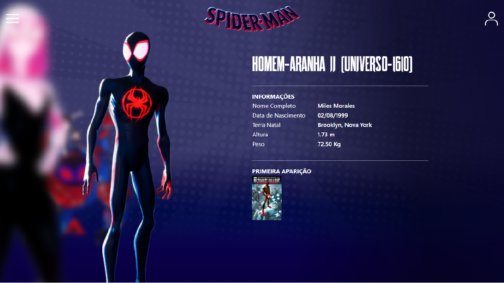

# Projeto Spider-verse



Este projeto é uma aplicação interativa inspirada no universo do Homem-Aranha e foi desenvolvido com base em uma live no YouTube em parceria com a DIO (Digital Innovation One).

## Tecnologias utilizadas no projeto

- [React.js](https://reactjs.org) (v18)
- [Next.js](https://nextjs.org) (v13)
- [TypeScript](https://www.typescriptlang.org) (v5)
- [ESLint](https://eslint.org)
- [Framer Motion](https://www.framer.com/api/motion)
- [Tailwind](https://tailwindcss.com/)

## Instruções de execução

Para rodar o projeto no ambiente local siga os seguintes passos:

1. Abra o terminal e navegue até o diretório raiz do projeto.

2. Instale as dependências do projeto executando o comando a seguir:

```bash
  npm install
  # ou
  yarn install
  # ou
  pnpm install
```

3. Após a instalação das dependências, inicie o servidor de desenvolvimento local com o comando:

```bash
  npm run dev
  # ou
  yarn dev
  # ou
  pnpm dev
```

4. Acesse [http://localhost:3000](http://localhost:3000) com o seu navegador para ver o resultado.
